# Política monetária no Chile em um modelo Novo-Keynesiano: calibração e evidência

**Ferramentas:** GNU Octave 11.1 + Dynare 7.1 (solução e estimação); Python (dados, econometria, tabelas e figuras).
**Dados:** Banco Central de Chile (BCCh), trimestrais, 2001Q1–2026Q1 (acesso em 15/06/2026).

> Reprodutibilidade: todos os números deste relatório saem dos arquivos em `outputs/tables/` e
> `outputs/dynare/`, gerados pela pipeline descrita no `README.md`. Cada figura declara sua fonte.

---

## 1. Introdução e objetivo

Este trabalho implementa, para o **Chile**, um modelo Novo-Keynesiano (NK) mínimo de três equações
— hiato do produto \(x_t\), inflação \(\pi_t\) e taxa nominal de política
\(i_t\) — e o utiliza para quatro exercícios: (i) mapear cada parâmetro a um alvo observável
("parâmetro ↔ alvo"); (ii) **estimar** descritivamente a persistência da taxa de política e, como
extensões exploratórias, uma regra de Taylor, versões da curva de Phillips e a moda posterior do
modelo; (iii) analisar a
sensibilidade das funções impulso-resposta (IRFs) à inclinação da curva de Phillips \(\kappa\) e à
reação à inflação \(\phi_\pi\), com diagnóstico de Blanchard–Kahn; e (iv) construir cenários
mecânicos condicionais e incondicionais.

O exercício distingue rigorosamente três tipos de número: **calibração** (valores impostos),
**estimação** (valores extraídos de dados reais do BCCh) e **simulação** (resultados internos do
modelo). A base de dados é real e oficial; as conclusões empíricas são apresentadas com cautela
diante da pequena amostra, das hipóteses de identificação e das limitações do modelo fechado.

### 1.1 Auditoria das páginas 26–55 da Aula 5

O projeto foi confrontado item a item com o bloco da aula dedicado à calibração, solução, momentos,
FEVD, IRFs e previsões. A matriz completa está em
`docs/assignment_review_pages_26_55.md`. Além dos exercícios obrigatórios, foram executadas **as duas
alternativas** sempre que o roteiro oferecia uma escolha:

1. \(\rho_i\) **estimado** por AR(1) e \(\rho_i=0{,}80\) **calibrado**;
2. calibração dos choques para a **matriz didática de FEVD** e para uma **matriz alternativa**;
3. previsão condicional impondo uma trajetória para o **juro** e impondo uma trajetória para a
   **inflação**, além da previsão incondicional;
4. calibração transparente e verificações econométricas por MQO, VI/2SLS e moda posterior.

Essa ampliação torna visível quais conclusões são robustas à escolha metodológica e quais dependem
do alvo adotado. O material privado serviu apenas para orientar a auditoria; nenhum texto, página ou
figura da aula foi reproduzido.

## 2. Por que o Chile

O Chile é um caso instrutivo para um NK mínimo: o BCCh conduz a política em um regime de
**metas de inflação**, buscando que a inflação projetada em um horizonte de dois anos se situe em
3%, utiliza uma **Tasa de Política Monetaria (TPM)** claramente identificada e dispõe de
estatísticas públicas de boa qualidade. Isso permite identificar com nitidez a taxa de política, a
inflação (IPC) e o produto, que são exatamente as variáveis do modelo. Ao mesmo tempo, o Chile é uma
**economia pequena e aberta**, fortemente exposta ao preço do cobre, ao câmbio e às condições
financeiras externas — dimensões ausentes do modelo fechado e discutidas nas limitações (Seção 14).

## 3. O modelo

As três equações, em frequência trimestral e em desvios do estado estacionário, são:

\[
x_t = \mathbb{E}_t x_{t+1} - \tfrac{1}{\sigma}\,(i_t - \mathbb{E}_t \pi_{t+1} - r^*) + e_{x,t},
\]
\[
\pi_t = \beta\, \mathbb{E}_t \pi_{t+1} + \kappa\, x_t + e_{\pi,t},
\]
\[
i_t = \rho_i\, i_{t-1} + (1-\rho_i)\,(r^* + \phi_\pi \pi_t + \phi_x x_t) + e_{i,t}.
\]

A **curva IS** descreve a demanda intertemporal: quando o juro real *ex ante* \(i_t-\mathbb{E}_t\pi_{t+1}\)
excede a taxa neutra \(r^*\), o consumo e a demanda corrente caem e o hiato se reduz; \(\sigma\) governa
essa sensibilidade. A **curva de Phillips (NKPC)** é prospectiva: a inflação depende da inflação
esperada e do hiato, com inclinação \(\kappa\) que sintetiza rigidez nominal (Calvo), markups e
elasticidades. A **regra de Taylor** com suavização descreve a reação sistemática do banco central:
\(\phi_\pi\) mede a força da resposta à inflação, \(\phi_x\) a preocupação com a atividade, \(\rho_i\)
o gradualismo, e \(e_{i,t}\) a inovação de política não explicada pela regra. Há um estado
predeterminado (\(i_{t-1}\)) e duas variáveis *forward-looking* (\(x_t,\pi_t\)).

## 4. Dados (Banco Central de Chile)

Os dados são baixados da API REST (SieteRestWS) da Base de Datos Estadísticos do BCCh
(`python/build_chile_dataset.py`). As séries e transformações estão documentadas em
`data/clean/dataset_metadata.json`:

| Série | Código BCCh | Transformação |
|---|---|---|
| TPM (taxa de política, % a.a., diária) | `F022.TPM.TIN.D001.NO.Z.D` | média trimestral; \(i_q=(1+\text{TPM}/100)^{1/4}-1\) |
| IPC (variação mensal, %) | `F074.IPC.VAR.Z.Z.C.M` | inflação trimestral composta (fração) |
| PIB real, dessazonalizado, ref. 2018 | `F032.PIB.FLU.R.CLP.EP18.Z.Z.1.T` | log + filtro HP (\(\lambda=1600\)) ⇒ hiato |

A amostra cobre **2001Q1–2026Q1 (101 trimestres)**. Os dados refletem a história chilena recente: a
TPM varia de **0,5%** (mínimo da pandemia, 2020–21) a **11,25%** (aperto de 2022–23); a inflação
anual vai de cerca de **−3,2%** a **14,9%** (pico de 2022); o hiato atinge **−14%** em 2020Q2
(colapso da Covid-19). A Figura `data_overview.png` mostra as três séries.

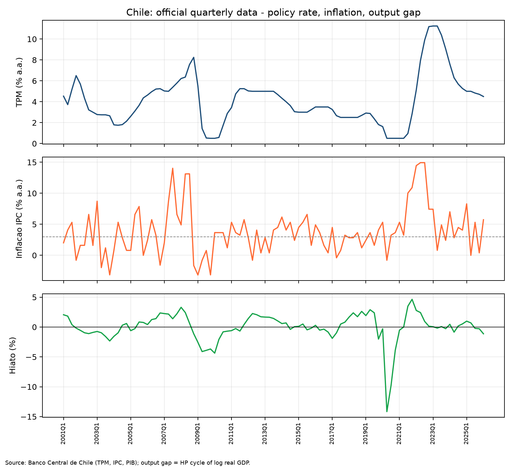

## 5. Calibração e a tabela "parâmetro ↔ alvo"

A calibração-base (`outputs/tables/parameter_targets.csv`) e seus alvos empíricos:

| Parâmetro | Valor calibrado | Estimativa empírica | Alvo / mapeamento |
|---|---|---|---|
| \(r^*\) anual | 3% | 2,35% a.a. (proxy HP descritiva) | cenários 2/3/4% |
| \(\beta\) | 0,99264 | — | \(1/(1+r^*_q)\) |
| \(\sigma\) | 1,0 | 3,44 (moda posterior exploratória) | EIS da literatura; log-utilidade |
| \(\kappa\) | 0,10 | 0,098 (Phillips backward, MQO-HAC) | grade {0,07; 0,10; 0,13} |
| \(\rho_i\) | **0,934** | 0,934 (AR(1), EP-HAC 0,049) | AR(1) da TPM trimestral |
| \(\phi_\pi\) | 1,75 | 3,05 (VI-HAC) / 0,83 (MQO-HAC) / 1,03 (MAP) | grade [1,3; 2,2] |
| \(\phi_x\) | 0,50 | 0,26 (MAP) | fixado em 0,5 |
| \(\sigma_{e_x}\) | 0,00500 | — | alvo ilustrativo de FEVD |
| \(\sigma_{e_\pi}\) | 0,00277 | — | alvo ilustrativo de FEVD |
| \(\sigma_{e_i}\) | 0,00068 | — | alvo ilustrativo de FEVD |

O ponto de partida é uma calibração transparente (\(\sigma=1\), \(\kappa=0{,}10\),
\(\phi_\pi=1{,}75\), \(\phi_x=0{,}5\)). A persistência \(\rho_i\) e os desvios-padrão dos choques são
recalibrados no exercício (Seções 7 e 8). A coluna empírica fornece referências, não testes
definitivos dos parâmetros estruturais: por exemplo, o AR(1) da TPM não identifica isoladamente a
suavização da regra, e a Phillips backward não identifica a NKPC prospectiva.

## 6. Taxa neutra \(r^*\) e fator de desconto \(\beta\)

Taxas anuais não podem ser inseridas diretamente em um modelo trimestral: é preciso converter para a
frequência do modelo. Usa-se \(r^*_q=(1+r^*_{a.a.})^{1/4}-1\) e \(\beta=1/(1+r^*_q)\)
(`outputs/tables/rstar_beta_table.csv`):

| \(r^*\) a.a. | \(r^*_q\) | \(\beta\) |
|---|---|---|
| 2% | 0,00496 | 0,99506 |
| 3% | 0,00742 | 0,99264 |
| 4% | 0,00985 | 0,99024 |

Um \(r^*\) maior implica \(\beta\) **menor** (agentes menos pacientes) e um estado estacionário
nominal mais alto, já que no modelo \(\bar{i}=r^*\). Esses são **cenários de calibração**, não
estimativas da taxa neutra chilena. Como referência empírica (`outputs/tables/rstar_estimates.csv`),
o juro real *ex post* médio na amostra é baixo (~0,3% a.a., afetado por surpresas inflacionárias),
enquanto a **tendência HP do juro real** termina em ~**2,35% a.a.**, dentro da grade considerada.
Esse valor de ponta é sensível ao filtro e não deve ser chamado de estimativa estrutural de
\(r^*\). Métodos de espaço de estados, como Laubach–Williams, fugiriam ao escopo deste NK mínimo.

## 7. Estimação de \(\rho_i\) por AR(1)

Estimou-se \(i_t = \alpha + \rho_i\, i_{t-1} + u_t\) por MQO com erros-padrão de Newey–West (HAC),
sobre a TPM trimestral real (`python/estimate_rhoi_chile.py`, `outputs/tables/rhoi_estimate.csv`):

\[
\hat{\rho}_i = 0{,}934 \quad (\text{EP-HAC } 0{,}049;\ \text{IC95\%}\ [0{,}84;\ 1{,}03]),\quad R^2=0{,}87,\ n=100.
\]

A meia-vida implícita é de ~**10 trimestres** e a média de longo prazo \(\alpha/(1-\rho_i)\approx
4{,}1\%\) é próxima da média amostral da TPM. A persistência é elevada, mas o intervalo de 95%
inclui a unidade. Além disso, um AR(1) em níveis pode misturar suavização de curto prazo, mudanças
de regime e movimentos da taxa neutra. Por isso, \(\rho_i=0{,}934\) é usado como alvo descritivo
solicitado pelo exercício, mantendo-se 0,80 como fallback quando não há dados reais.

## 8. Estratégia de choques e duas calibrações da FEVD

Os desvios-padrão dos choques são escolhidos para produzir IRFs e momentos legíveis e aproximar
participações de variância declaradas. Para testar as duas possibilidades do roteiro,
`python/calibrate_shocks.py` resolve **duas calibrações**:

| Calibração | \(\sigma_{e_x}\) | \(\sigma_{e_\pi}\) | \(\sigma_{e_i}\) | RMSE |
|---|---:|---:|---:|---:|
| Referência didática da aula | 0,00500 | 0,00331 | 0,00080 | 1,82 p.p. |
| Alternativa do pesquisador | 0,00500 | 0,00277 | 0,00068 | 0,95 p.p. |

A alternativa do pesquisador, usada no baseline, mira 45/10/45 para o hiato, 2/80/18 para a
inflação e 10/15/75 para o juro. A referência didática mira aproximadamente 37,5/10,0/52,4,
1,4/82,3/16,2 e 8,7/14,7/76,6, respectivamente. A solução didática alcança
37,4/11,6/51,0 para \(x\), 1,1/80,3/18,6 para \(\pi\) e 5,9/17,4/76,6 para \(i\).

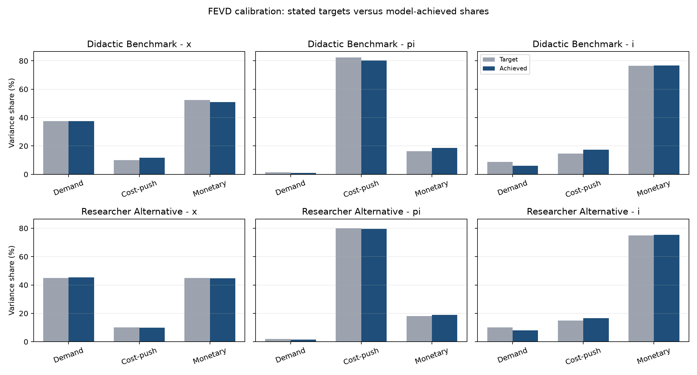

Não é possível acertar nove parcelas arbitrárias com apenas três desvios-padrão; o algoritmo
minimiza o erro conjunto, ancorando \(\sigma_{e_x}=0{,}005\). Sob \(\rho_i=0{,}934\), uma inovação
monetária se propaga por vários trimestres, de modo que \(\sigma_{e_i}\) precisa ser pequeno. Em
ambas as alternativas, a FEVD é propriedade do modelo calibrado, **não** decomposição histórica
identificada para o Chile.

## 9. Solução, estabilidade e determinação

O Dynare resolve o modelo (1ª ordem) e verifica Blanchard–Kahn. No **baseline** do Chile
(`outputs/dynare/baseline/`), o estado estacionário é \(x=\pi=0\), \(i=r^*=0{,}00742\). Os autovalores
têm módulos **0,656 / 1,040 / 1,379**: exatamente **dois** fora do círculo unitário para **duas**
variáveis *forward-looking*, de modo que a condição de Blanchard–Kahn é satisfeita e há solução
estável e única (status `determinate_bk_count`).

Não basta verificar \(\phi_\pi>1\) por inspeção. O mapa de determinação
(`python/analyze_determinacy.py`, Figura `determinacy_map.png`) varre \(\phi_\pi\) de 0,5 a 3,0
contando raízes estáveis a partir do polinômio característico: o modelo é **determinado para
\(\phi_\pi \ge 1{,}00\)** na grade numérica utilizada, dados os demais parâmetros. Isso não é uma
regra universal independente de \(\phi_x,\kappa,\beta\) e \(\rho_i\). Toda a grade principal
(1,3–2,2) é determinada, deslocando a discussão de \(\phi_\pi\) para a
**velocidade de convergência** (Seção 12). O módulo da raiz estável dominante (~0,64–0,66) mede a
persistência: quanto menor, mais rápido o retorno ao equilíbrio.

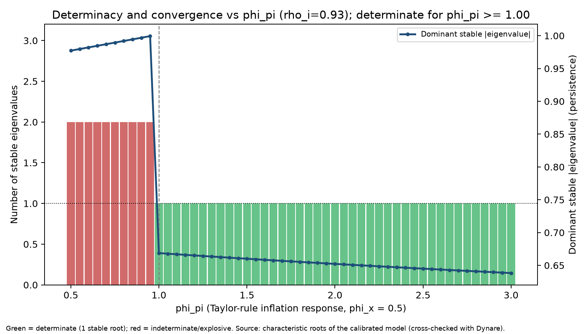

## 10. Resultados baseline e confronto com os dados

**Momentos teóricos** (`outputs/dynare/baseline/moments.csv`): desvios-padrão
\(\sigma_x=0{,}0061\), \(\sigma_\pi=0{,}0027\), \(\sigma_i=0{,}0007\); autocorrelações de 1ª ordem
\(0{,}30\) (hiato), \(0{,}05\) (inflação) e \(0{,}66\) (juros). A alta autocorrelação dos juros reflete
\(\rho_i=0{,}934\); a inflação é quase serialmente não correlacionada. A média dos juros é \(r^*\),
enquanto \(x\) e \(\pi\) têm média zero por construção (desvios).

O confronto com os dados deixa uma limitação importante visível. Em pontos percentuais trimestrais,
o baseline gera desvios-padrão de **0,607** para \(x\), **0,267** para \(\pi\) e **0,073** para \(i\),
contra **2,415**, **0,919** e **0,578** nos dados. Excluindo 2020Q2–2021Q4, o hiato ainda tem
desvio-padrão de **1,585**. As autocorrelações observadas, 0,695, 0,411 e 0,934, também excedem as
do modelo. Os choques calibrados entregam uma dinâmica ilustrativa e uma FEVD controlada, mas
**subestimam a volatilidade e a persistência empíricas**.

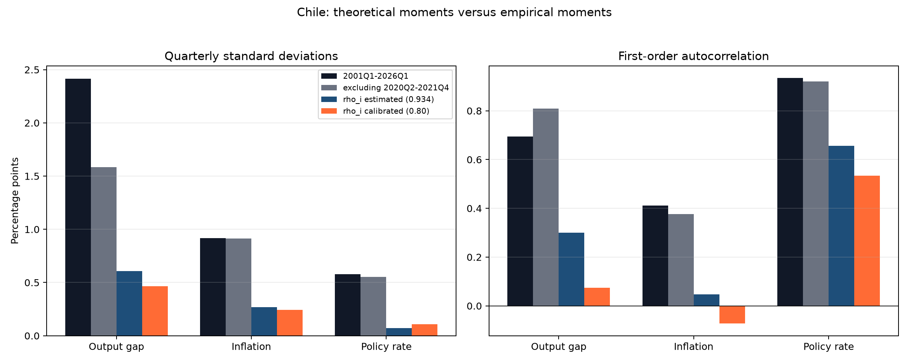

As correlações também diferem. O modelo produz
\(\operatorname{corr}(x,i)=-0{,}594\) e
\(\operatorname{corr}(\pi,i)=-0{,}143\), enquanto nos dados brutos elas são positivas, 0,348 e
0,277. As correlações históricas misturam resposta endógena do banco central, regimes e choques, de
modo que não constituem um teste causal isolado. Ainda assim, confirmam que o NK mínimo não foi
estimado para reproduzir toda a distribuição conjunta das séries chilenas.

**FEVD baseline** (`outputs/dynare/baseline/fevd.csv`), em %:

| Variável | \(e_x\) (demanda) | \(e_\pi\) (custo) | \(e_i\) (monetário) |
|---|---|---|---|
| \(x\) | 45,4 | 9,9 | 44,7 |
| \(\pi\) | 1,5 | 79,5 | 19,0 |
| \(i\) | 8,1 | 16,6 | 75,3 |

O padrão é o imposto pelo alvo ilustrativo: **inflação dominada por choques de custo (~80%)**,
**juros pelo próprio choque monetário (~75%)** e **hiato dividido entre demanda e política
(~45/45)**. Portanto, a FEVD demonstra coerência interna da calibração, não uma descoberta
empírica. Como verificação computacional, o solver linear em Python produz respostas muito próximas
às do Dynare para a mesma parametrização.

A Figura `irf_baseline_all_shocks.png` mostra a grade 3×3 de IRFs (linhas \(x,\pi,i\); colunas
\(e_x,e_\pi,e_i\)):

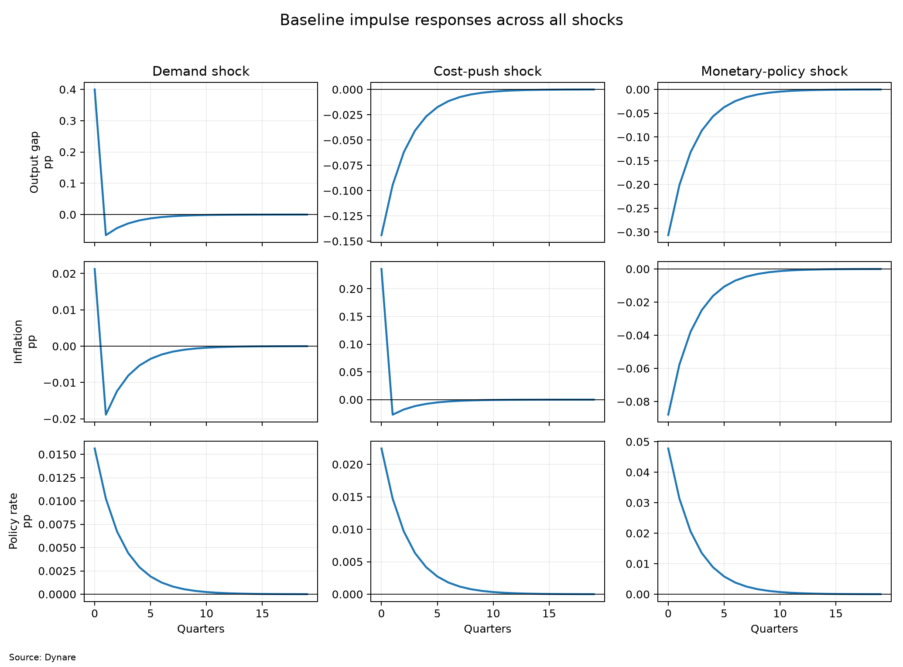

- **Choque de demanda (\(e_x>0\))**: no impacto, eleva \(x\) em 0,400 p.p., \(\pi\) em
  0,021 p.p. e \(i\) em 0,016 p.p. Contudo, \(x\) e \(\pi\) cruzam zero no horizonte 1 porque a
  resposta prospectiva da política gera *overshooting*. A resposta não é monotônica.
- **Choque de custo (\(e_\pi>0\))**: eleva a inflação e induz aperto monetário; o hiato **cai** — o
  *trade-off* clássico. A inflação sobe 0,236 p.p. no impacto, mas também cruza zero no horizonte 1
  por causa do aperto e do caráter prospectivo da NKPC.
- **Choque monetário (\(e_i>0\))**: eleva inesperadamente o juro nominal e o juro real *ex ante*,
  contrai imediatamente a demanda e **reduz a inflação já no impacto**. Para um choque de um
  desvio-padrão, as respostas são +0,048 p.p. no juro, −0,307 p.p. no hiato e −0,088 p.p. na
  inflação.

`irf_sign_checks.csv` confirma que os **nove sinais de impacto** coincidem com a teoria. Essa é uma
verificação mais adequada do que exigir monotonicidade de um sistema prospectivo.

## 11. Sensibilidade a \(\kappa\) (inclinação da curva de Phillips)

Comparando \(\kappa\in\{0{,}07;\,0{,}10;\,0{,}13\}\) (Figura `irf_kappa_comparison.png`), o pico da
resposta da inflação a um **choque de demanda** cresce monotonicamente com \(\kappa\):
**0,015 → 0,021 → 0,028 p.p.** Uma curva de Phillips mais inclinada transmite mais rapidamente a
atividade para os preços.

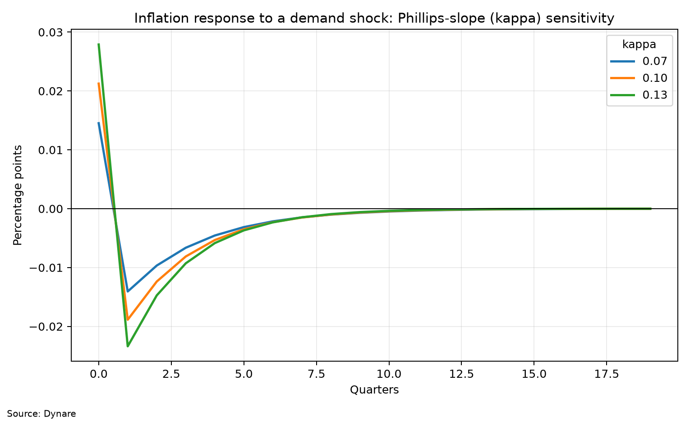

Há, porém, *trade-offs*: maior \(\kappa\) não "melhora tudo". Diante de um **choque de custo**, uma
NKPC mais inclinada faz o aperto monetário (que contrai o hiato) ser **mais eficaz** em desinflacionar,
de modo que o pico de inflação é até ligeiramente **menor** (0,245 → 0,228 p.p.). Em contrapartida,
o custo real acumulado do choque de custo, medido pela soma absoluta da IRF do hiato, cai de
**0,463 para 0,385 p.p.**. O módulo da raiz estável dominante recua de 0,687 para 0,630, reduzindo a
meia-vida de convergência de 1,85 para 1,50 trimestre. Ao mesmo tempo, maior \(\kappa\) amplifica a
inflação causada por demanda e a queda inflacionária causada por um aperto monetário.

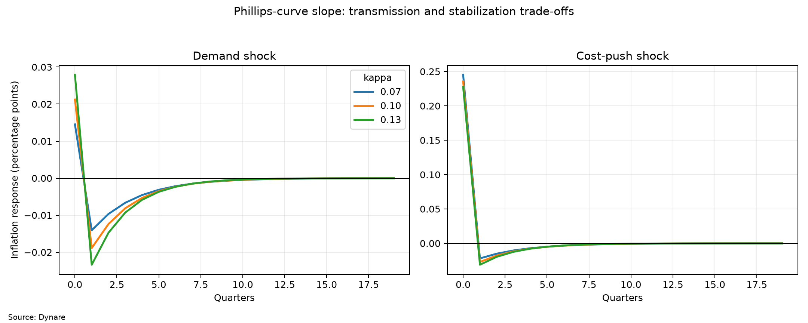

## 12. Sensibilidade a \(\phi_\pi\) (princípio de Taylor)

Variando \(\phi_\pi\) de 1,3 a 2,2 com \(\phi_x=0{,}5\), toda a grade é determinada. Um coeficiente
maior reduz o impacto inflacionário inicial do choque de custo de **0,242 para 0,230 p.p.** e diminui
o módulo da raiz estável dominante de 0,663 para 0,649, com meia-vida de 1,69 para 1,60 trimestre.
Mas a estabilização não é gratuita: a soma absoluta da resposta do juro cresce de
**0,050 para 0,080 p.p.** e a do hiato de **0,352 para 0,473 p.p.**.

A soma absoluta da IRF da inflação sobe ligeiramente, de 0,311 para 0,317 p.p., porque a inflação
cruza zero e apresenta *undershooting*. É correto afirmar que uma resposta mais forte reduz o
impacto e acelera marginalmente a convergência; seria incorreto dizer que reduz monotonicamente toda
medida de variabilidade inflacionária. Abaixo de \(\phi_\pi=1\), o modelo torna-se indeterminado na
grade ampliada. A `scenario_determinacy.csv` registra **19 modelos**, todos determinados nos
cenários principais.

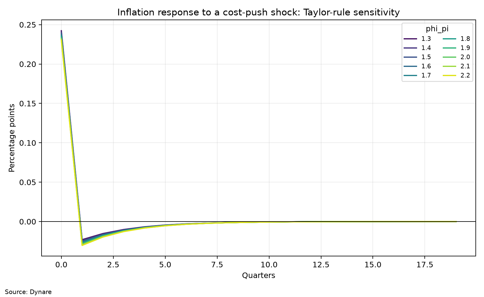

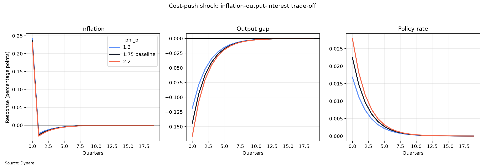

### 12.1 Persistência estimada versus calibrada

Também se executa a alternativa \(\rho_i=0{,}80\). Em comparação com o baseline estimado
\(\rho_i=0{,}934\), um choque monetário tem efeitos acumulados muito menores: a soma absoluta cai
de **0,139 para 0,098 p.p.** no juro, de **0,256 para 0,059 p.p.** na inflação e de
**0,891 para 0,278 p.p.** no hiato. A raiz estável dominante cai de 0,656 para 0,535. Usar o AR(1)
como \(\rho_i\) amplia fortemente a persistência do canal monetário, mas também expõe a limitação de
interpretar persistência reduzida como suavização estrutural.

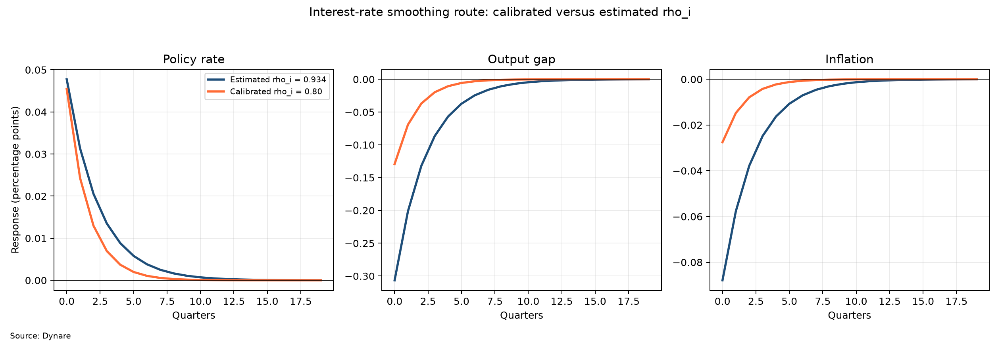

## 13. Análise econométrica I — regra de Taylor

Estimou-se a regra reduzida \(i_t = c + a\,i_{t-1} + b\,\pi_t + d\,x_t + \varepsilon_t\), com
\(\rho_i=a\), \(\phi_\pi=b/(1-a)\), \(\phi_x=d/(1-a)\) (erros-padrão estruturais por método delta),
por MQO-HAC e por **VI/2SLS-HAC** (instrumentos: defasagens de \(\pi\), \(x\) e do juro), como
verificação exploratória da simultaneidade entre o juro e inflação/hiato contemporâneos
(`outputs/tables/taylor_rule_estimates.csv`):

| Método | \(\rho_i\) | \(\phi_\pi\) | \(\phi_x\) | \(R^2\) | F 1º estágio \(\pi/x\) |
|---|---|---|---|---|---|
| MQO-HAC | 0,895 | 0,83 (EP 0,57) | 0,25 | 0,91 | — |
| VI/2SLS-HAC | 0,876 | **3,05** (EP 1,17) | −0,09 | 0,73 | 5,82 / 19,94 |

As especificações produzem respostas muito diferentes. Não é possível concluir apenas daí que MQO
é enviesado e VI está correto: o primeiro estágio da inflação tem F=5,82, sinal de instrumento
potencialmente fraco, e a incerteza de \(\phi_\pi\) é grande. A leitura prudente é que os dados
confirmam elevada persistência da taxa, mas identificam de forma imprecisa a reação estrutural à
inflação. O valor calibrado \(\phi_\pi=1{,}75\) funciona como cenário intermediário, não como média
formal das estimativas.

## 14. Análise econométrica II — curva de Phillips (\(\kappa\))

Estimou-se a NKPC sob três especificações (`outputs/tables/nkpc_estimates.csv`):

| Especificação | \(\kappa\) | EP | obs |
|---|---|---|---|
| *Backward* (MQO-HAC): \(\pi_t=c+\gamma_b\pi_{t-1}+\kappa x_t\) | **0,098** | 0,039 | 100 |
| *Forward* (VI-HAC): \(\pi_t=c+\gamma_f\pi_{t+1}+\kappa x_t\) | −0,050 | 0,130 | 98 |
| Restrita (\(\gamma_f=\beta\)) | 0,023 | 0,024 | 100 |

A estimativa *backward* é estatisticamente diferente de zero e próxima da calibração
(\(\kappa=0{,}10\)), mas pertence a outra especificação e não valida sozinha a NKPC prospectiva.
Na versão forward, o primeiro estágio da inflação futura é fraco (F=2,82), o sinal é negativo e o
erro-padrão é grande. A conclusão defensável é que a calibração de 0,10 é compatível com uma curva
reduzida backward, enquanto a estrutura prospectiva não é bem identificada nesta amostra.

## 15. Análise econométrica III — moda posterior do DSGE

Estimou-se o modelo completo no Dynare por **moda do posterior (MAP)**, usando priors convencionais
e como observáveis as séries em desvios
\(\pi,i,x\) (`dynare/nk_chile_estim.mod`; erros-padrão de Laplace a partir do Hessiano da moda,
recuperados em Python; `outputs/tables/bayesian_estimates.csv`):

| Parâmetro | Prior (média) | Moda do posterior | IC95% |
|---|---|---|---|
| \(\sigma\) | 1,00 | 3,44 | [2,22; 4,67] |
| \(\kappa\) | 0,10 | 0,086 | [0,00; 0,17] |
| \(\rho_i\) | 0,80 | 0,861 | [0,82; 0,91] |
| \(\phi_\pi\) | 1,50 | 1,03 | [0,70; 1,36] |
| \(\phi_x\) | 0,50 | 0,262 | [0,12; 0,40] |
| \(\sigma_{e_x}\) | 0,005 | 0,028 | [0,024; 0,033] |
| \(\sigma_{e_\pi}\) | 0,0025 | 0,0093 | [0,008; 0,011] |
| \(\sigma_{e_i}\) | 0,002 | 0,0018 | [0,0015; 0,0021] |

Leituras: \(\kappa\approx0{,}09\) é próximo da calibração; \(\rho_i\approx0{,}86\) é alto;
\(\phi_\pi\approx1{,}03\) fica próximo do limiar de determinação e seu intervalo de Laplace inclui
valores abaixo de um. O desvio do choque de demanda \(\sigma_{e_x}\) é elevado, possivelmente pelo
*outlier* da Covid-19 (hiato de −14% em 2020Q2), que o filtro de Kalman atribui a um grande choque de
demanda. Como `mh_replic=0`, esse exercício não produz amostras MCMC nem intervalos credíveis
posteriores integrais; os intervalos são aproximações locais de Laplace e devem ser tratados como
exploratórios. Extensões naturais incluem erros de medida, tratamento explícito da Covid e MCMC.

## 16. Previsões incondicional e condicionais

A previsão segue o roteiro das páginas 48–55: é gerada **pelo próprio Dynare**
(`dynare/nk_chile_forecast.mod`, executado por `python/run_forecast.py`). O comando
`estimation(datafile='chile_observables_dynare.csv', mode_compute=0, forecast=8)` mantém a calibração
fixa — não há estimação bayesiana —, roda o suavizador de Kalman sobre o histórico de 2001Q1 a 2026Q1
e projeta oito trimestres à frente. O Dynare devolve `oo_.forecast.Mean` e as bandas
`HPDinf`/`HPDsup`. Os observáveis estão em desvios da média amostral (`pi = infl_q − média`,
`i = i_q − média`, `x = hiato − média`); as séries são reapresentadas em nível anualizado somando de
volta as médias (TPM média **4,09% a.a.**; inflação média **3,79% a.a.**; meta oficial de **3%**).

No cenário **incondicional**, o modelo parte do estado suavizado do último trimestre (a taxa passada é
o único estado). A inflação projetada vai de **3,30%** no horizonte 1 a **3,76%** no horizonte 8,
convergindo para a média amostral; a TPM cai de **4,36%** para **4,11%**; e o hiato fecha de −0,42%
para ≈0. Como a curva de Phillips é puramente *forward-looking* (sem indexação), o modelo **não tem
inércia de inflação** e reverte rápido à média — daí o salto visível entre os 5,7% observados e a
projeção. A média incondicional do Dynare coincide, até o último dígito, com a forma reduzida exata
(`a_i = 0{,}656`), o que valida a solução.

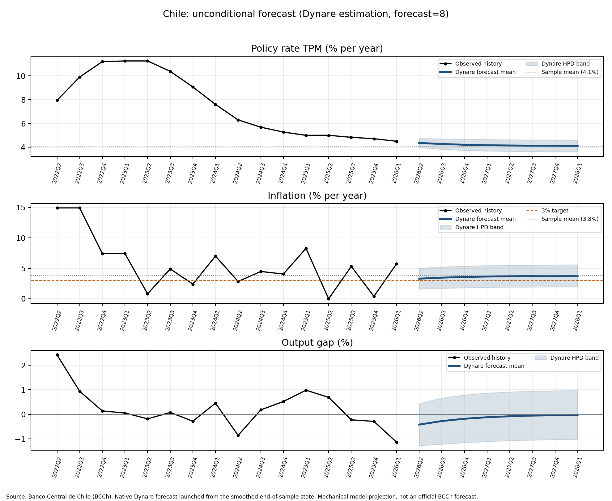

Para as duas formas de condicionamento da aula, usou-se `conditional_forecast` no Dynare e a mesma
forma reduzida ancorada no estado atual, com três cenários:

1. **trajetória do juro:** manter a TPM em 4,5% por dois trimestres (juro constante);
2. **trajetória do juro:** apertar para ~5,1% (≈ +1 p.p. sobre a média) por quatro trimestres;
3. **trajetória da inflação:** forçar a inflação à meta de 3% a.a. por quatro trimestres.

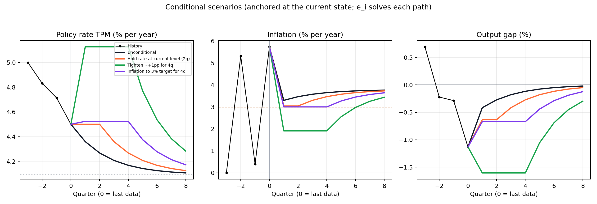

Manter a TPM em 4,5% (acima da média de 4,09%) já é levemente contracionista: a inflação no horizonte
1 cai para **3,04%** e o hiato para −0,63%. O aperto para 5,1% derruba a inflação a **1,91%** ao custo
de um hiato de −1,60% — a amplificação típica de fixar o juro num modelo *forward-looking*. Forçar a
meta de 3% (abaixo da média de 3,79%) exige aperto: a TPM sobe a **4,52%** e o hiato vai a −0,67%. A
figura de choques implícitos `e_i` torna explícito o custo de cada caminho.

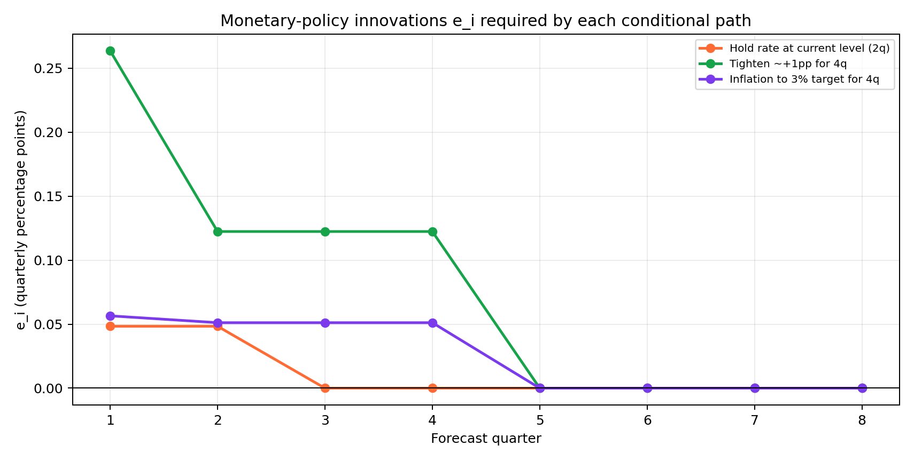

O `conditional_forecast` nativo do Dynare parte do estado estacionário; por isso o cenário de meta foi
calibrado com o desvio correto (3% = `pi_dev = −0,00192`, já que o estado estacionário corresponde à
média de 3,79%). Os choques controlados são tratados, na solução de primeira ordem, como não
antecipados antes de cada período: **não** é previsão perfeita. E como o único estado predeterminado é
\(i_{t-1}\), o algoritmo não carrega de forma independente o último hiato e a última inflação. As
trajetórias são testes de mecanismo, não recomendação de política nem previsão oficial.

## 17. Implicações de política monetária

O modelo sintetiza quatro mensagens. Primeiro, uma resposta ativa à inflação é central para a
determinação; na parametrização usada, a fronteira está em torno de \(\phi_\pi=1\), mas a evidência
econométrica é imprecisa. Segundo, **a suavização estimada é muito alta** e amplia a persistência dos
efeitos monetários em relação à alternativa de 0,80, embora o AR(1) possa misturar gradualismo,
regime e taxa neutra. Terceiro, choques de custo impõem um *trade-off*: elevar \(\phi_\pi\) reduz o
impacto inflacionário, porém aumenta o deslocamento de produto e juros e pode gerar
*undershooting*. Quarto, FEVD e cenários condicionais mostram quais choques seriam necessários
**dentro do modelo**, não o que ocorreu historicamente nem o que o BCCh deveria fazer.

## 18. Limitações

O modelo é **fechado e pequeno**, enquanto o Chile é uma economia **aberta**. Estão ausentes: a taxa
de **câmbio** e o *pass-through* cambial; o preço do **cobre** e os termos de troca; a demanda externa
e o prêmio de risco; fluxos de capital; indexação; fricções financeiras; heterogeneidade; o limite
inferior dos juros; e questões de credibilidade e comunicação. A taxa neutra é fixada em cenários e os
choques são calibrados; \(r^*\) provavelmente varia no tempo. Além disso, o *outlier* da Covid-19
distorce momentos e a estimação (Seção 15), e a NKPC *forward-looking* é mal identificada (Seção 14).
Os momentos e a FEVD do modelo **não** são automaticamente os observados no Chile.

## 19. Extensões

Naturais: (i) um **NK de economia aberta** com curva IS com câmbio, paridade descoberta de juros (UIP)
e Phillips com componente importada; (ii) uma regra de Taylor que reaja ao câmbio; (iii) **estimação
bayesiana completa** com MCMC, *priors* alternativos e *dummies*/erros de medida para a Covid;
(iv) \(r^*\) variável no tempo (Laubach–Williams/HLW); (v) um filtro estrutural para o hiato; e
(vi) comparação sistemática de momentos e IRFs do modelo com SVARs estimados para o Chile.

## 20. Conclusão

Recalibrou-se o NK mínimo para o Chile com **dados reais do BCCh**, usando
\(\rho_i=0{,}934\) do AR(1) como alvo descritivo e comparando-o com 0,80. Foram calibradas tanto a
FEVD didática quanto uma alternativa explicitamente declarada. O baseline é determinado
(Blanchard–Kahn 2/2), e os nove sinais de impacto das IRFs são coerentes com o mecanismo do modelo,
embora várias respostas apresentem *overshooting*. As extensões econométricas mostram elevada
persistência dos juros, uma Phillips backward próxima de 0,10 e grande incerteza na identificação
prospectiva e na regra de Taylor. O confronto com os dados revela que o modelo subestima
volatilidades e persistências. As sensibilidades e previsões condicionais dos dois tipos organizam
os mecanismos centrais sem transformar o modelo em descrição completa, previsão oficial ou
recomendação para a economia chilena.

## 21. Fontes e reprodutibilidade

- **Dados:** [Banco Central de Chile, Base de Datos Estadísticos](https://si3.bcentral.cl/Siete/ES/Siete/Cuadro/CAP_TASA_INTERES/MN_TASA_INTERES_09/TPM_C1),
  séries `F022.TPM…`, `F074.IPC.VAR…`, `F032.PIB…EP18…`; acesso em 15/06/2026
  (ver `data/clean/dataset_metadata.json`).
- **Marco monetário:** [Política Monetaria do BCCh](https://www.bcentral.cl/web/banco-central/areas/politica-monetaria),
  meta de inflação projetada de 3% no horizonte de dois anos.
- **Uso dos dados:** [condições de uso do BCCh](https://www.bcentral.cl/web/banco-central/condiciones-de-uso).
- **Software:** GNU Octave 11.1.0 + Dynare 7.1; Python (numpy, pandas, statsmodels, scipy, matplotlib).
- **Pipeline e arquivos de saída:** ver `README.md`. Todas as tabelas estão em `outputs/tables/` e os
  resultados do Dynare em `outputs/dynare/`.
